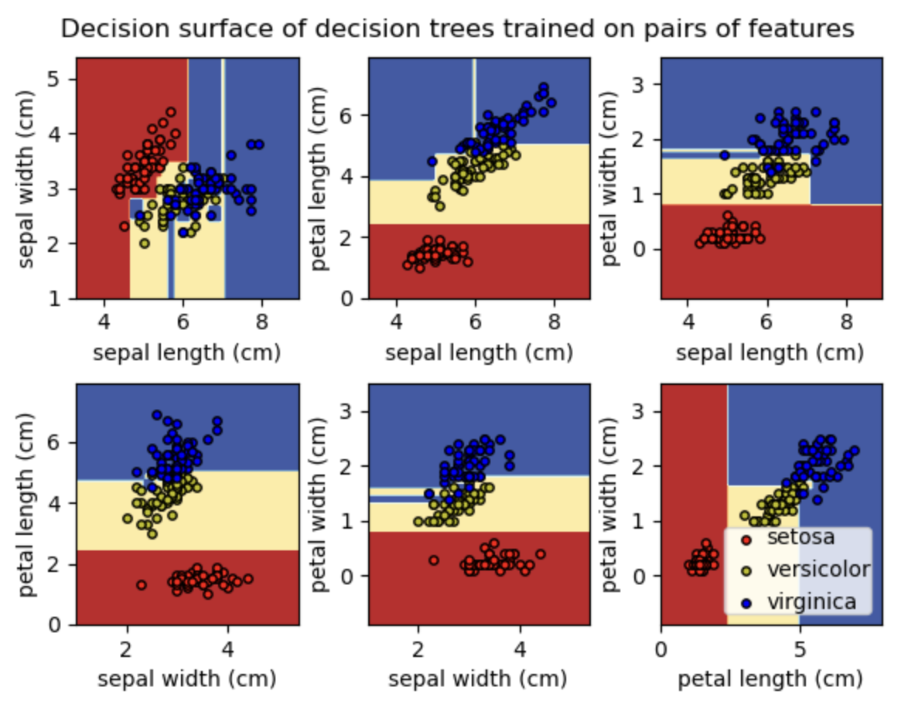

### Questions

1. Complete the decision tree implementation in tree/base.py.
The code should be written in Python and not use existing libraries other than the ones already imported in the code. Your decision tree should work for four cases: i) discrete features, discrete output; ii) discrete features, real output; iii) real features, discrete output; real features, real output. Your decision tree should be able to use GiniIndex or InformationGain as the criteria for splitting. Your code should also be able to plot/display the decision tree. 

    > You should be editing the following files.
  
    - `metrics.py`: Complete the performance metrics functions in this file. 

    - `usage.py`: Run this file to check your solutions.

    - tree (Directory): Module for decision tree.
      - `base.py` : Complete Decision Tree Class.
      - `utils.py`: Complete all utility functions.
      - `__init__.py`: **Do not edit this**

    > You should run _usage.py_ to check your solutions. 

2. 
    Generate your dataset using the following lines of code

    ```python
    from sklearn.datasets import make_classification
    X, y = make_classification(
    n_features=2, n_redundant=0, n_informative=2, random_state=1, n_clusters_per_class=2, class_sep=0.5)

    # For plotting
    import matplotlib.pyplot as plt
    plt.scatter(X[:, 0], X[:, 1], c=y)
    ```

    a) Show the usage of *your decision tree* on the above dataset. The first 70% of the data should be used for training purposes and the remaining 30% for test purposes. Show the accuracy, per-class precision and recall of the decision tree you implemented on the test dataset.

    b) Use 5 fold cross-validation on the dataset. Using nested cross-validation find the optimum depth of the tree.
    
    > You should be editing `classification-exp.py` for the code containing the experiments.

3. 
    a) Show the usage of your decision tree for the [automotive efficiency](https://archive.ics.uci.edu/ml/datasets/auto+mpg) problem.
    
    b) Compare the performance of your model with the decision tree module from scikit learn.
    
   > You should be editing `auto-efficiency.py` for the code containing the experiments.
    
4. Create some fake data to do some experiments on the runtime complexity of your decision tree algorithm. Create a dataset with N samples and M binary features. Vary M and N to plot the time taken for: 1) learning the tree, 2) predicting for test data. How do these results compare with theoretical time complexity for decision tree creation and prediction. You should do the comparison for all the four cases of decision trees.

    >You should be editing `experiments.py` for the code containing the experiments.


You can answer the subjectve questions (timing analysis, displaying plots) by creating `assignment_q<question-number>_subjective_answers.md`


5.  Show plots for bias and variance vs increasing complexity (depth) of decision tree on the given regression dataset. You can use the decision tree implementation from assignment 1 (or sklearn tree).

    ```python
    import numpy as np

    np.random.seed(1234)
    x = np.linspace(0, 10, 50)
    eps = np.random.normal(0, 5, 50)
    y = x**2 +1 + eps

    #for plotting
    import matplotlib.pyplot as plt
    plt.plot(x, y, 'o')
    plt.plot(x, x**2 + 1, 'r-')
    plt.show()
    ```

<hr />

> Classification dataset

```python
from sklearn.datasets import make_classification
X, y = make_classification(
n_features=2, n_redundant=0, n_informative=2, random_state=1, n_clusters_per_class=2, class_sep=0.5)

# For plotting
import matplotlib.pyplot as plt
plt.scatter(X[:, 0], X[:, 1], c=y)
```

6. Shuffle the dataset and split the classification dataset into a training set (70%) and a test set (30%). Implement a weighted decision tree and train it using the training set. Use uniform(0,1) distribution to assign weights randomly to the samples. Plot and visualise the decision tree boundary. Use the test set to evaluate the performance of the weighted decision tree and compare your implementation with sklearn. You can copy your implementation of decision tree from assignment 1 to this repository and edit it to take sample weights as an argument while learning the decision tree(Default weight is 1 for each sample).

7. a) Implement Adaboost on Decision Stump (depth=1 tree). You can use Decision Tree learnt in assignment 1 or sklearn decision tree and solve it for the case of real input and discrete output. Edit `ensemble/ADABoost.py`

   b) Implement AdaBoostClassifier on classification data set. Plot the decision surfaces and compare the accuracy of AdaBoostClassifier using 3 estimators over decision stump. Include your code in `q3_ADABoost.py`.

   Example for decision surface
   

   You can refer to the [this](https://machinelearningmastery.com/plot-a-decision-surface-for-machine-learning/) for plotting decision surface. You **cannot** use any inbuilt functions like `DecisionBoundaryDisplay` for this.

8. a) Implement Bagging(BaseModel, num_estimators): where base model is the DecisionTree you had implemented in assignment 1 (or sklearn decision tree). In a later assignment, you would have to implement the above over LinearRegression() also, but for now you only have to implement it for Decision Trees. Edit `ensemble/bagging.py`. Use `q4_Bagging.py` for testing.

   b) Implement bagging in parallel fashion, where each decision tree is learnt simultaneously. Perform timing analysis for parallel implementation and normal implementation.

   You can implement this by refering to [this](https://machinelearningmastery.com/multiprocessing-in-python/) link.

   You can perform multi processing anyway you see fit, a suggested way is to add a parameter `n_jobs` in your Bagging Classifier and add code for multi processing there itself.

9. a) Implement RandomForestClassifier() and RandomForestRegressor() classes in `tree/randomForest.py`. Use `q5_RandomForest.py` for testing.

   b) Generate the plots for classification data set. Include you code in `random_forest_classification.py`

10. Implement Gradient Boosted Decision trees on the regression dataset given below. You need to edit the `ensemble/gradientBoosted.py` and `q6_gradientBoosted.py`

   ```python
   from sklearn.datasets import make_regression

   X, y= make_regression(
       n_features=3,
       n_informative=3,
       noise=10,
       tail_strength=10,
       random_state=42,
   )

   # For plotting
   import matplotlib.pyplot as plt
   plt.scatter(X[:, 0], y)
   ```

   You can refer to the following links: \
   [Gradient Boost Part 1 (of 4): Regression Main Ideas](https://www.youtube.com/watch?v=3CC4N4z3GJc) \
   [Gradient Boost Part 2 (of 4): Regression Details](https://www.youtube.com/watch?v=2xudPOBz-vs)

You must include your insights (like timing analysis, plots, etc.) for all questions by creating `assignment_q<question-number>_subjective_answers.md` files.
