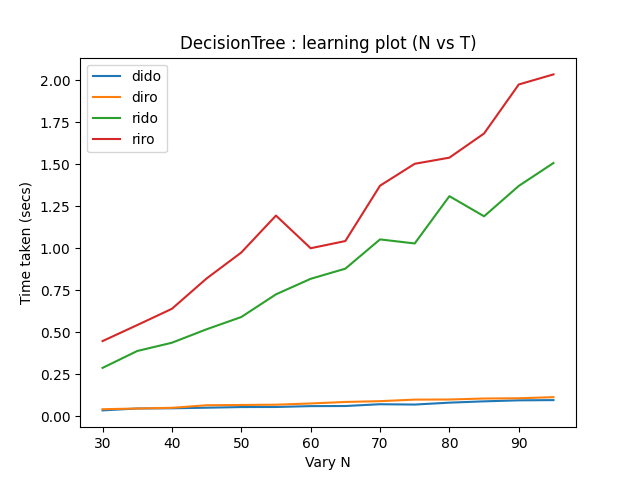
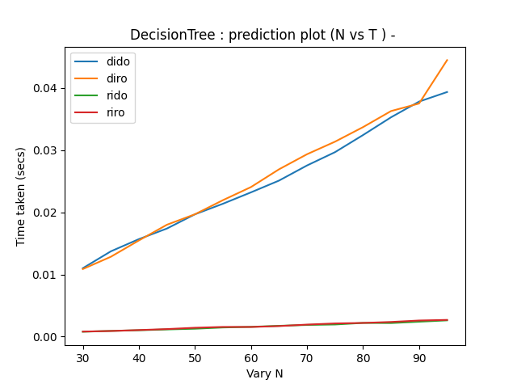
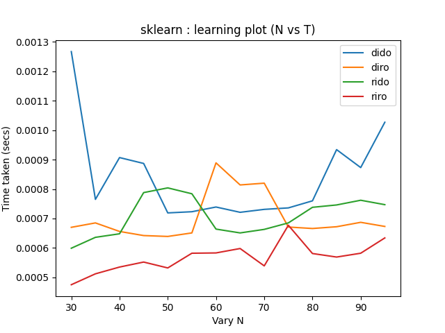
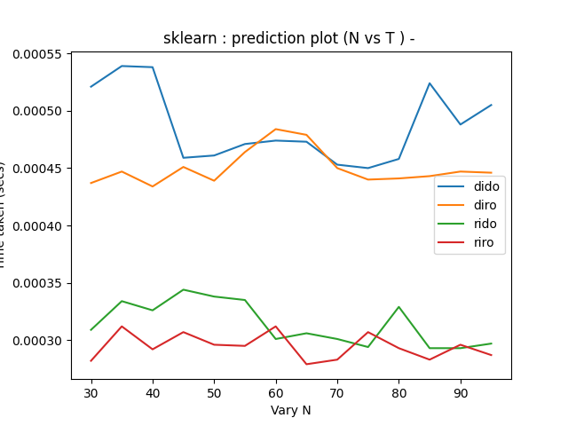
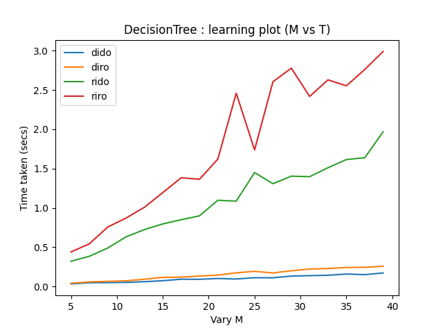
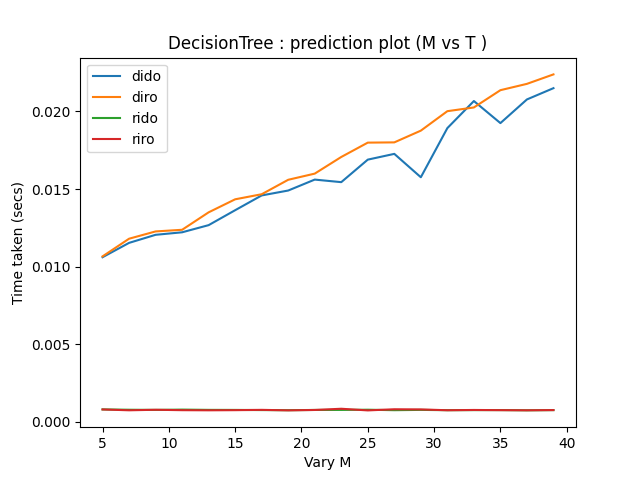
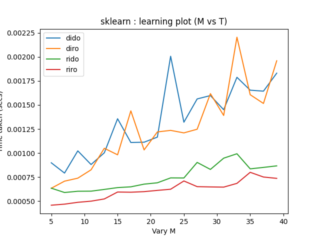
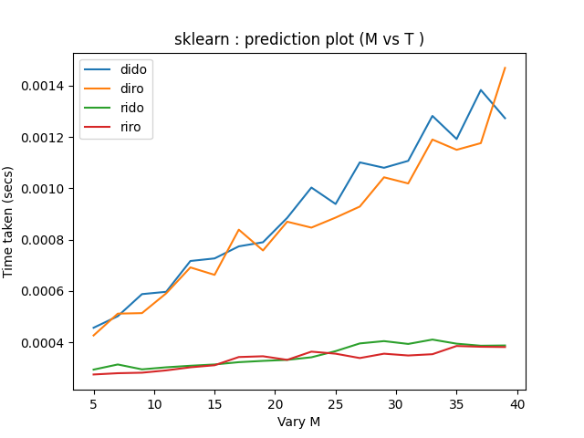

# Q4

## Ranging N, Constant M
Keeping number of binary features (M) constant and varying number of samples (N)

### Using DT implementation 

#### Learning:  

#### Prediction: 

### Using Sklearn library 

#### Learning: 

#### Prediction:  

### Analysis
- The theoritical time complexity of decision tree is O(Nlog(N)). From just looking at the learning plots, we can't determine the exact time complexity of our decision tree, but it is clear that it is worse that O(Nlog(N)). This might be because splitting in our 
decision tree is not optimized. On the other hand, Sklearn takes O(1) constant time as it more efficient and optmized.

- "rido" and "riro" take more time than "diro" and "dido" because of  splitting in real input. "riro" takes more time than "rido". 

- Comparing discrete and real inputs: 
The time taken for learning and predicting in the case of discrete feature is less than that of real feature. This is because in the case of discrete features, since we have discrete values, to calculate information gain, we can divide the data easily by clubbing similar labels, and calculate the information gain in one go.
But in the case of real input, we have to split the dataset at multiple points, and then calculate the information gain for each split. We have to find the optimum split for all rows in the column. 

- Comparing discrete and real outputs: 
For discrete output, accuracy is calculated using counting and dividing. 
For real outputs, we have to calculate the rmse, which is more complex and hence, takes more time. 

- time complexity comparisions: "riro" > "rido" > "diro" > "dido" 

 

 

## Constant N, Ranging M

Number of samples (N) remains constant and number of binary features (M) is varied. 

### Using DT implementation

#### Learning:

#### Prediction:

### Using Sklearn library 

#### Learning:

#### Prediction 

### Analysis 
- The theoritical time complexity of decision tree is O(M). For learning, T varies with M linearly, similar to theoritical decision tree. On the other hand, Sklearn does in O(1) constant time as it is more efficient and optimized. 
- As discussed in the previous analysis, "riro" and "rido" take more time than "diro" and "dido" because of the same reason. 

---
# Q6
Criteria : gini_index

* Accuracy:  0.896551724137931
* Precision for class 1: 0.9285714285714286
* Recall for class 1: 0.8666666666666667
* Precision for class 0: 0.8666666666666667
* Recall for class 0: 0.9285714285714286

Criteria : information_gain
* Accuracy:  0.896551724137931
* Precision for class 1: 0.9285714285714286
* Recall for class 1: 0.8666666666666667
* Precision for class 0: 0.8666666666666667
* Recall for class 0: 0.9285714285714286

Accuracy (sk-learn):  0.8620689655172413

The accuracy of the decision trees varies depending upon the input argument in np.random.seed(42). Sometimes, the accuracy of our decision tree is very close to sk learn and some times more (as in this case).

Note: The plots are stored in the 'figures' folder.

---

Changes to be made for implementing Weighted Decision Tree:
* The files inside utils has to be changed, such as entropy, information gain, gini gain, gini index, etc. to accomodate the weights.
* We also have to change function calls in base.py to accomodate one extra argument of weights.
---
# Q8
## a) Bagging(BaseModel, num_estimators)

Inference from graph:

Each estimators have different decesion boundaries as they are trained on indendently sampled data with replacement.
The common decision tree made up by combining all the estimators is more accurate than individual models as expected and as discussed in the class.

Note: The plots are stored in the 'figures' folder.

---
## b) Parallel Processing:

n_estimators = 2

* Criteria : information_gain
* Accuracy:  0.68
* Precision:  0.5945945945945946
* Recall:  0.9565217391304348
* Precision:  0.9230769230769231
* Recall:  0.4444444444444444

* n_jobs = 1, elapsed time: 0.016554400000000413 seconds
* n_jobs = 2, elapsed time: 0.009594900000000628 seconds
* n_jobs = 5, elapsed time: 0.011143000000000569 seconds
* n_jobs = -1, elapsed time: 0.015887499999999832 seconds

---

n_estimators = 5
* Criteria : information_gain
* Accuracy:  0.98
* Precision:  1.0
* Recall:  0.9565217391304348
* Precision:  0.9642857142857143
* Recall:  1.0

* n_jobs = 1, elapsed time: 0.009440099999999951 seconds
* n_jobs = 2, elapsed time: 0.018398599999999377 seconds
* n_jobs = 5, elapsed time: 0.01878759999999957 seconds
* n_jobs = -1, elapsed time: 0.01867239999999981 seconds

---
n_estimators = 7

* Criteria : information_gain
* Accuracy:  0.96
* Precision:  0.9565217391304348
* Recall:  0.9565217391304348
* Precision:  0.9629629629629629
* Recall:  0.9629629629629629

* n_jobs = 1, elapsed time: 0.013186500000000212 seconds
* n_jobs = 2, elapsed time: 0.025036400000000292 seconds
* n_jobs = 5, elapsed time: 0.02296269999999989 seconds
* n_jobs = -1, elapsed time: 0.02353259999999935 seconds

---

Inference from the above results:
* As the number of estimator increases, the accuracy increases (with small variatin from the trend at accruracy near 1 as in the case of n_estimators = 5 and n_estimators = 7). This would have been more significant when the number of data points would have been large.
* As the number of estimators increases, the average elapsed time increases because training more number of estimators takes more time.
* For a constant number of estimators, as the number of jobs increases, ideally the time should decrease due to parallelism. But in this case, the trend is not as ideal because of the two reasons. First, the dataset used for the training is small, and overhead to allocate CPU is comparable with the time to train the estimators, therefore, it can affect significantly the elapsed time. Secondly, there is a tradeoff between the size of the task chosen and the number of processor to be chosen for that particular task. It is not the case that when we use all the CPU then time will be less, because it takes time to allocate memory and processing. The trend would have been more visible when the task is huge enough as compared to overheads.
----

# Q10
For np.random.seed(6):
* RMSE: 126.49
* MAE: 124.62

For np.random.seed(42):
* RMSE: 107.82
* MAE: 77.81

The values of RMSE and MAE varies with the change in the parameters inside the np.random.seed() as different datasets are generated.

The data generated seems noisy and this algorithm might not be the best one for such data.